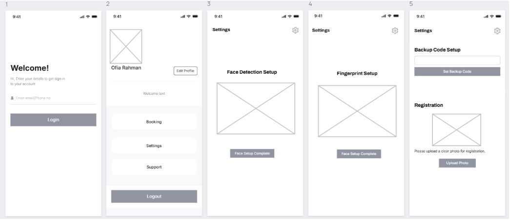
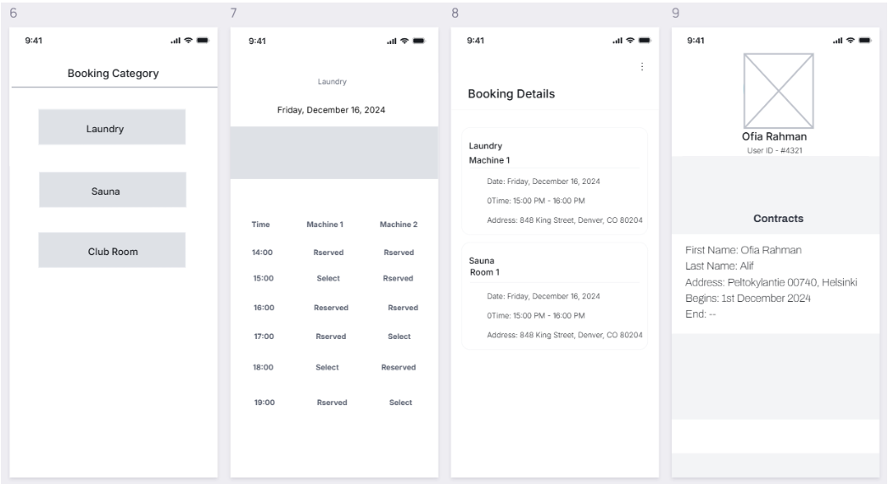

# <h1 align="center">Presenting the problem and initial idea</h1>

In most apartment buildings, it is common to see physical keys being used for entry to
apartments, main entrances, and shared facilities such as laundry and sauna rooms. Most
buildings have password-protected gates, which do not make either system very friendly or
secure. Tenants are often inconvenienced by having to carry keys everywhere, they are
afraid of losing them, and the penalties are huge-in the region of €300-if keys get lost.
Besides, gate codes tend to fail after hours or other situations not anticipated. The various
facility booking applications are helpful to date but still require keys physically to enter, hence
limiting their effectiveness.

Current solutions involve a self-powered key system without batteries, instead utilizing
unique digital IDs for secure access. It allows dynamic updates of access rights without
changing the hardware, can be programmed to open multiple locks, and is tamper-resistant
to prevent unauthorized duplication and tampering. Also, smart locks and IoT-based systems
enable remote access, which will improve convenience. However, system failures, privacy
concerns, and lack of integration with existing services, wear and tear due to heavy usage,
may be prone to adjustment in systems are some of the challenges facing their wide
adoption. What is really needed is a more robust solution with the user as the central focus
of such technology.

The initial idea is that face detection would be installed on a centralized application for
housing. Cameras would be installed at all major access points, including main gates,
apartment doors, and shared facilities, for hands-free entry. The tenants would register their
faces in the app, and a backup digital code would be provided in case the recognition fails.
The system will avoid the inconvenience of carrying keys and the risk of losing them, and it
will be incorporated into the facility booking application to ensure maximum usability and
security.

This idea solves existing problems by automating access, simplifying workflows, and aligning
with tenants' expectations about modern, convenient solutions. Furthermore, at each step,
privacy and reliability concerns will be taken care of through robust data encryption,
transparency, and failsafe mechanisms.

# <h1 align="center">User requirements and the main findings</h1>

From the survey and focus group discussion in part 2, I tried to find out the answers of my
three research questions and found out that users prefer hands-free lock systems over the
key lock system. Furthermore, they also think that it would be better to integrate the booking
system of housing to be integrated in the same app, which can be convenient for them. Most
of them think that a facial recognition system would be more convenient but on the other
hand, they are little concerned about their biometric data and also the cost of making the
whole new system.

# <h1 align="center">Design Iteration 1</h1>

Wireframe (Low fidelity prototype) - 

