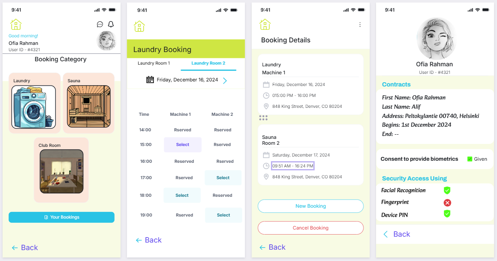

# <h1 align="center">Presenting the problem and initial idea</h1>

In most apartment buildings, it is common to see physical keys being used for entry to
apartments, main entrances, and shared facilities such as laundry and sauna rooms. Most
buildings have password-protected gates, which do not make either system very friendly or
secure. Tenants are often inconvenienced by having to carry keys everywhere, they are
afraid of losing them, and the penalties are huge-in the region of €300-if keys get lost.
Besides, gate codes tend to fail after hours or other situations not anticipated. The various
facility booking applications are helpful to date but still require keys physically to enter, hence
limiting their effectiveness.

Current solutions involve a self-powered key system without batteries, instead utilizing
unique digital IDs for secure access. It allows dynamic updates of access rights without
changing the hardware, can be programmed to open multiple locks, and is tamper-resistant
to prevent unauthorized duplication and tampering. Also, smart locks and IoT-based systems
enable remote access, which will improve convenience. However, system failures, privacy
concerns, and lack of integration with existing services, wear and tear due to heavy usage,
may be prone to adjustment in systems are some of the challenges facing their wide
adoption. What is really needed is a more robust solution with the user as the central focus
of such technology.

The initial idea is that face detection would be installed on a centralized application for
housing. Cameras would be installed at all major access points, including main gates,
apartment doors, and shared facilities, for hands-free entry. The tenants would register their
faces in the app, and a backup digital code would be provided in case the recognition fails.
The system will avoid the inconvenience of carrying keys and the risk of losing them, and it
will be incorporated into the facility booking application to ensure maximum usability and
security.

This idea solves existing problems by automating access, simplifying workflows, and aligning
with tenants' expectations about modern, convenient solutions. Furthermore, at each step,
privacy and reliability concerns will be taken care of through robust data encryption,
transparency, and failsafe mechanisms.

# <h1 align="center">User requirements and the main findings</h1>

From the survey and focus group discussion in part 2, I tried to find out the answers of my
three research questions and found out that users prefer hands-free lock systems over the
key lock system. Furthermore, they also think that it would be better to integrate the booking
system of housing to be integrated in the same app, which can be convenient for them. Most
of them think that a facial recognition system would be more convenient but on the other
hand, they are little concerned about their biometric data and also the cost of making the
whole new system.

# <h1 align="center">Design Iteration 1</h1>

Wireframe (Low-fidelity prototype) - 

---

**Goal:** At first I made a wireframe design of how the proposed mobile app will look like,
based on the user requirements I found in my project part 2 I tried implementing most of
them in the wireframe design. The goal of this design iteration is to find out the reaction of
the base design of the app interface and also to get suggestions of what to include more for
user convenience. From my three research questions - RQ1: What are the main usability
problems tenants face with the current system?, RQ2: How do tenants consider the use of a
biometric access system, such as facial recognition?, RQ3: What features or functionalities
do tenants prioritize in a new access system? I have already found the answers of RQ1 and
RQ2 in my project part 2. Also, I have found the idea of starting the design prototype from
the answers of RQ3 from project part 2. Now, I am trying to dig in more to find out about my
RQ3 to help design my prototypes.

---

**Choosing the prototype:** I chose wireframe design at first as I am proposing an app for the lock
system as well as for booking the services given by the housing. I thought wireframe would
be a good choice to show the features of the app. I tried making the app so simple
considering the design and usability heuristics. The simple interface is for users easy
learning and capturing the features as well as affordances.

---

**Evaluation method used:** After my design iteration 1, which is basically my low-fidelity prototype I had to
make sure that I am going in the correct direction, so I chose to have a semi-structured
interview to evaluate my design iteration 1. The reason for choosing a semi-structured
interview evaluation process is that it is still just a wireframe prototype most of the users may
not understand or may not give suggestions to improve the design. So, I decided to interview
one of my friends who is taking the HCI course with me. The idea of interviewing him is that
he also has the knowledge of design prototypes and user requirements and he may give
better suggestions about the design prototype.

---

**Evaluation result:** From the interview, I got very important and particular suggestions which helped
me to analyze my design more and do the design iteration 2. I showed him my design and
asked questions about different pages of my app prototype, what could be done better or
what is good in the design. So he gave me a few ideas, adding different login ways can help
the user, for example using google, apple ID or other ways where there personal information
is already present, highlighting the select button of booking to make it more visible, clickable.
Further, he thinks that there should be buttons for cancel/new bookings, also there should be
a go back sign for the users convenience of using the app. The transcript of the interview is
given below -

# <h3 align="center">Semi-Structured Interview Transcript</h3>

**Interviewer:** Thank you for taking the time to participate in this interview. We will be
discussing the first design prototype for the facial recognition access and booking system,
and I would like to hear from you about this prototype. I am sharing my screen to show you
my design prototype. I do have some specific questions, but any thoughts or suggestions are
welcome. Shall we begin?

**Interviewee:** Sure, let's go ahead.

**Interviewer:** Great! First, how was the login process in the prototype? Was that intuitive for
you?

**Interviewee:** It was okay, but I think it can be more flexible. As of now, it only supports one
way to log in. It would be nice to have options, like logging in with Google or Apple accounts,
or even using a national ID. It's more convenient that way, because users have their
personal details already filled up on those accounts.

**Interviewer:** That is a very good suggestion. We will provide options for logging in. Now,
going further, have you seen the booking page? Is it a simple interface?

**Interviewee:** To be frank, the booking buttons were not that catching. I had to spend some
time looking for them. I believe they should be highlighted in some way, either by color,
shading or size, to make them catch one's attention.

**Interviewer:** That's helpful feedback, we shall work on highlighting them. Anything else you
want to suggest about the booking interface?

**Interviewee:** I could not find an evident option for canceling or adding a new booking, and it
is my opinion that having dedicated buttons for these activities would help significantly to
make the process much less confusing.

**Interviewer:** That makes perfect sense. We'll look to implement those buttons as well. Did
you find anything that I need to add more for the user's convenience?

**Interviewee:** I didn't feel like there was an option to "go back", and a couple of times I found
myself stuck. An evident "go back" button would really help, at least for the first time.

**Interviewer:** Alright, got it. We will implement a "go back" indication in the second iteration.
What other comments regarding this prototype would you like to give?

**Interviewee:** On the whole, not too shoddy for a starting point, but the aforementioned
changes should make it very user-friendly/intuitive.

**Interviewer:** Thank you very much for all these constructive observations!

**Interviewee:** You are welcome. Sure-looking forward to viewing those updates!

---

# <h1 align="center">Design Iteration 2</h1>

(Medium-fidelity prototype) - 

---

**Goal:** The goal of this design iteration is to update the design as per the suggestions I have
got from the evaluation of design iteration 2. Other than implementing the design
suggestions from the semi-structured interview I have also analyzed my design and found
some ideas to improve the design. I have added a logo to attract a good user impression, it
will also help users to remember the app. I also added some pictures in the booking page to
make it interactive and easily recognizable for the user. I noticed that I did not add any
dashboard button for the dashboard of the profile, so I added the dashboard button.
Furthermore, I added guiding texts in the registration page for registering, face detection,
fingerprint and the backup code to help the user with the registration process. I came across
these ideas when I tried to follow the usability heuristics, Heuristics by Nielssen, 1994. For
example, Consistency and standards, Aesthetic and minimalist design, Help and
documentation. I think these techniques were serving the purpose of my RQ3 too in helping
me design in-depth.

---

**Choosing the prototype:** I have used the medium-fidelity prototype in design iteration 2, because they
are more detailed than low-fidelity prototype, it is more detailed for getting feedback and will
help to validate design decisions.

---

**Evaluation method used:** I used survey evaluation method in my design iteration 2 as in this design iteration I
made an interactive prototype with apps.visily.ai and I wanted to see how my users are
enjoying the navigation of the prototype design as well as how they are feeling about the
interface. So, with typeform I made a survey questionnaire and I sent the link of my survey
which also has my design prototype link attached to it to 5 participants, they all responded
very well.

---

**Evalutaion results:** I had 6 close-ended question and 1 open-ended question to know my users
suggestions and I got the results as follows -

I asked the question and asked to rate it on a Scale: 1 (Very Difficult) to 5 (Very Easy). 60%
of the participants think that the interface navigation was easy, while 40% think that it was
very easy.

When asked how satisfied they are with the overall design on a Scale: 1 (Not Satisfied) to 5
(Very Satisfied) 80% of the participants said they are satisfied. 20% are very satisfied.

All the 5 participants think that the registering system in my design is easy and hassle free.

The open-ended question gave me the best overview and suggestions about my next design
iteration. From the answers of this question I get the idea that most of the users prefer
colorful designs which are more appealing to them. Then I got some very unique and
interesting suggestions like, I should make a consent button for the user before registering
the biometrics and also I should give my users the control to choose which biometric they
want to use for the system lock/security lock system.

Overall, the survey was very impactful I would say even though I did not attach all my
questions of the survey here but I will provide the link of the result of my survey. I got a good
overall rating in my design iteration 2, now I need to consider the idea from the survey in my
design iteration 3.

---

Form link - https://b6g3g81m6aw.typeform.com/to/AAwHiB29
Result summary report of the survey - https://b6g3g81m6aw.typeform.com/report/AAwHiB29/5t8Rc4n88SlclaIf

---

# <h1 align="center">Design Iteration 3</h1>

(High-fidelity design) -

This is the design of the locking system interface which should be installed in front of
the doors of the apartments of tenants-

---

**Goal:** This is the design iteration 3 and it is the last design phase of this HCI project I am
conducting. In this design my target is to update the design with maximum improvement
possible by incorporating the findings from design evaluation survey of the design iteration 2
as well as analyzing and finding out more possible improvements by myself. I added
soothing neon colours to my design as users considered the colored interface. I also added
a consent button upon clicking ‘yes’ user can continue with the biometric registration with
consent check showing in the interface. Further I added Manage Setup where users can
choose by which biometric or backup code they want to use for their security lock system of
their apartment. I have also analysed that according to the usability heuristics I should use
visibility of system status, which is in this case while setting up face recognition and
fingerprint. Lastly, I added consent and biometric status in the dashboard below the contact
information of the user. After this design, I felt like I had mostly found out the answer to my
RQ3. Other than the app design I also tried to design the lock system interface which was
my idea as well. In front of all the doors of the apartments this device should be installed so
after user registration the housing company can set their biometrics into the system. Then
the tenants can use their biometric to open gates of their apartments, sauna, laundry. This
device will have a camera and fingerprint scanner to match tenants biometrics, if it matches
the door will open. If the biometric does not work the tenant can use backup code to unlock
their gates.

---

**Choosing the prototype:** I chose high-fidelity prototype for design iteration 3 as this is my final design
iteration and I wanted to make it more detailed and polished from all the findings of my
design evaluation of previous two iterations. I want to finalise this design so that further
according to the users' needs I can develop a system like this.

---

**Evaluation method used:** For my last design iteration I have chosen to conduct heuristic evaluation with two
participants, one friend from my bachelor’s and a senior from Data Science. Both of them
have knowledge about HCI and Nielsen’s 10 Usability Heuristics. The reason for choosing
this evaluation method is to evaluate my usability heuristics of the design, which I have
added based on my knowledge. About the required features I already got user feedback in
my design iteration 2. The heuristic evaluation was conducted individually by the evaluators
and the results were combined.

---

**Evaluation results:** Below I am presenting the result of the evaluation in a table format -

| **Heuristic**                       | **Strengths**                                 | **Issues**                                                                                   | **Evaluator 1 Notes**                                                                                             | **Evaluator 2 Notes**                                                                     | **Severity Rating** | **Proposed Change**                                                                                     |
|-------------------------------------|-----------------------------------------------|----------------------------------------------------------------------------------------------|------------------------------------------------------------------------------------------------|------------------------------------------------------------------------------------------|---------------------|---------------------------------------------------------------------------------------------------------|
| **1. Visibility of System Status**  | Progress bar indicator for biometric setup.   | No feedback after the user selects "Consent" for biometric registration.                    | Mentioned no confirmation feedback.                                                          | Same observation, highlighted that it confuses the user.                                 | 3                   | Add confirmation message such as "Consent saved successfully".                                          |
| **2. Match Between System and Real World** | Most of the terminology, e.g., "Face Detection Setup," "Fingerprint Setup" meets user expectations. | "Setup Face ID" is a bit too technical and may confuse non-technical users.                  | Suggested using simpler terms like "Face Recognition Setup."                               | No issue raised.                                                                         | 2                   | Replace "Setup Face ID" with "Face Recognition Setup."                                                   |
| **3. Consistency and Standards**    | All screens have the same overall layout and iconography. | "Manage Setup" screen toggles are not labeled, making their purpose somewhat unclear.         | Raised concern about toggle clarity. Users might not understand toggle functions.            | Same observation.                                                                         | 3                   | Add labels describing what each toggle does (e.g., "Enable Face Recognition").                         |
| **4. Error Prevention**             | N/A                                           | No confirmation when toggling biometric features in the "Manage Setup" screen.              | Suggested adding a confirmation dialog.                                                      | Same observation, mentioned risk of accidental toggles.                                  | 4                   | Add a confirmation dialog when toggling biometric options.                                              |
| **5. Aesthetic and Minimalist Design** | Clean and minimal interface design across screens. | No issue raised.                                                                             | N/A                                                                                            | N/A                                                                                      | N/A                 | N/A                                                                                                     |
| **6. Recognition Rather than Recall** | Options like biometric registration and login alternatives (Google, Apple, NID) are visible. | Registration screen does not provide visual examples of acceptable photos for "Upload Photo." | Mentioned users may not be aware of what kind of photo is acceptable for upload.             | Agreed, lack of guidance may lead to failed uploads.                                     | 3                   | Provide visual examples of acceptable photo formats, such as a small sample image.                      |
| **7. Help Users Recognize, Diagnose, and Recover from Errors** | N/A                                           | No error message shown when biometric registration fails.                                    | Highlighted lack of error message guidance. Suggested adding specific error messages (e.g., "Face not detected, please try again"). | Same observation.                                                                         | 4                   | Display clear error messages for failed biometric setups.                                                |
| **8. Flexibility and Efficiency of Use** | Login screen provides multiple options (Google, Apple, NID), increasing user convenience. | The buttons (Google, Apple, NID) are not prominent enough on the login screen.               | Suggested highlighting them with color or better placement.                                  | N/A                                                                                      | 2                   | Make login options more visually distinct (e.g., use icons or colors).                                   |

Overall the evaluations results were very effective as they tried to follow all the heuristic
while evaluating and gave their best feedback. I think until this point of evaluation I managed
to find out the answer of my RQ3 and I managed to implement those answers in my design.
As this is my last design iteration of this project I will not further do any design iteration for
now.

# <h1 align="center">Discussion about the design</h1>

I have done 3 design iterations and for all of the iterations I tried to implement the
suggestions and feedback I got from the evaluation methods I chose. I also managed to
implement most of the user requirements I found from my project part 2, as I am just in my
design phase and I did not develop the app or the lock system interface so I am not sure
about the cost which was also a user requirement. I will definitely consider the cost if I further
work with my design to develop the final product. Another requirement was the concern
users have with their biometric information storing in the app, this also needs to be the topic
of focus in the future. Furthermore, the evaluation result I got from the design iteration 3 is
also very crucial and I will fix all the issues I found from the feedback. 

My design is different from the existing solutions in a sense that, in the same app people are doing all the things
related to their apartments which is I think very convenient for the users, also in this way the
housing company will also be aware of the actions of users as well. If I talk about the design
itself It outcompetes various solutions in respect to a highly integrated, user-friendly interface
coupled with upgraded biometric security features, targeted specifically for housing systems.
Also, while many of the existing systems today provide merely a way of login by using a
password/PIN, the design includes multilayer choices from Google and Apple to NID,
similarly, an actual strong biometric enrollment with fingerprint, face recognition, and even
backup codes that will be safer. Additionally, the introduction of visual progress indicators
and consent-driven biometric setup embeds the concern for privacy and fosters trust among
users. This well-thought-out blend of flexibility, security, and usability makes it quite different
from any other housing profile management solution.

# <h1 align="center">Discussion about the process</h1>

The design process taught the importance of iterative development and user-centered
thinking in effective solution development. By integrating feedback from methods like
interviews, cognitive walkthroughs, and heuristic evaluations, I was able to identify critical
user needs and usability challenges. Each design iteration refined the features to strike a
balance between functionality, accessibility, and aesthetics, showing how prototypes evolve
based on user feedback. I understand the importance of security, ease of use, and clarity in
communicating to the users while knowing that design is a process which may be endless; it
requires flexibility and cooperation when one faces unexpected obstacles to obtain the best
user experience. I enjoyed the overall process.

