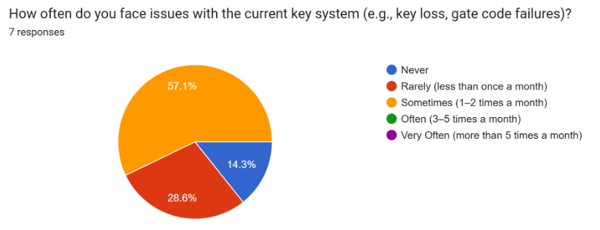
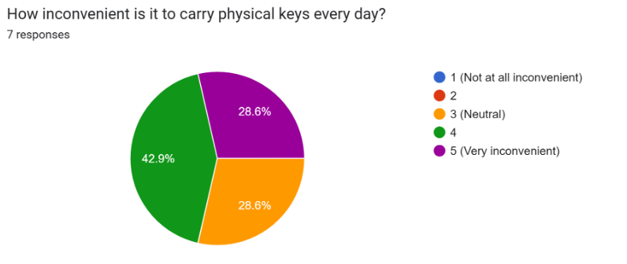
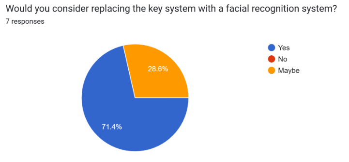
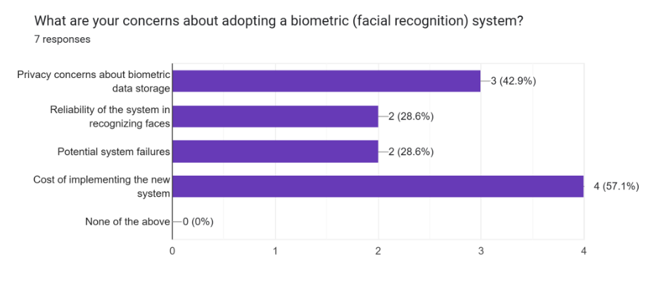
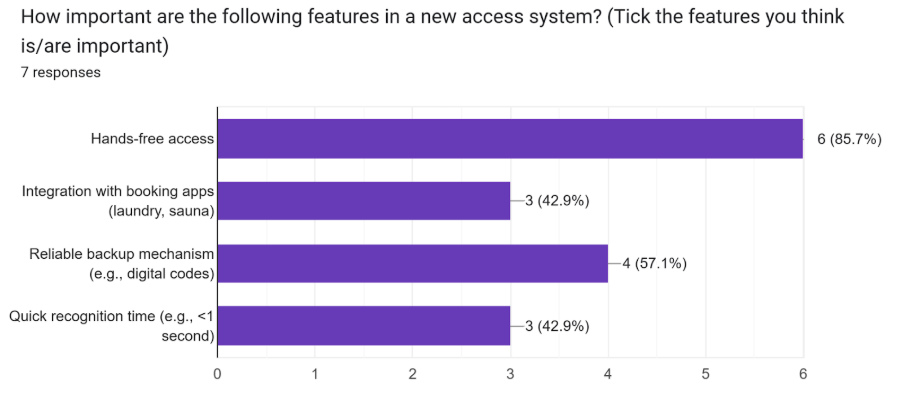
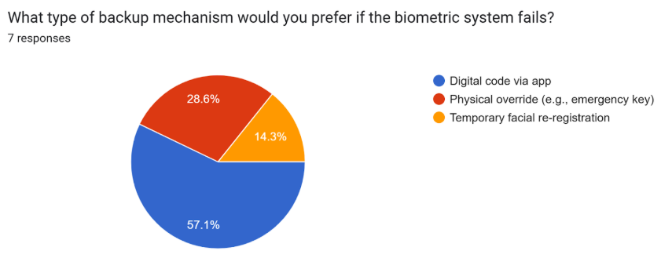
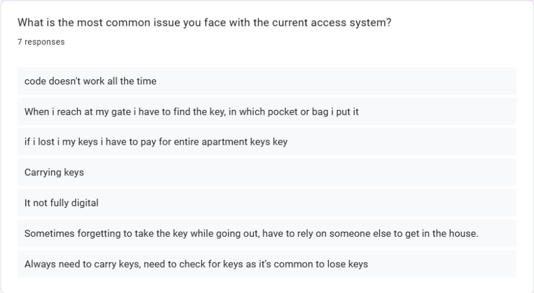
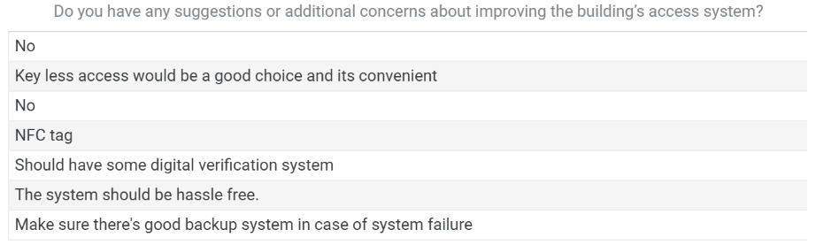

# 🔐 Innovative Door Lock System Design

This repository documents the **design process, user research, and evaluation** behind a smart and innovative door lock system tailored for real-world usability and enhanced security.

## 📌 Project Overview

The goal of this project is to develop an intuitive and secure door lock system that addresses common user pain points such as forgotten keys, accessibility issues, and a lack of adaptability to user habits. Through multiple design iterations and continuous feedback, the system evolves into a user-centered solution.

## 🧩 Key Features

- Touchless or code-based locking/unlocking
- Easy installation for users of all skill levels
- Designed with both aesthetics and security in mind
- Informed by real user needs, surveys, and interviews

## 📁 Repository Contents

- `Identifying the Problem.md` – Describes the real-world need for this door lock system and the motivation behind the design.
- `Understanding the User.md` – Details user personas, needs, and early findings based on real-world interactions.
- `Conducting an interview.md` – Summarizes user interviews to validate design goals and uncover usability challenges.
- `Design and Evaluation.md` – Documents the design iterations, prototypes, and user feedback, including visual artifacts.
- `survey responses of user requirement findings.pdf` – Survey data from initial user requirement exploration.
- `survey responses of design iteration 2 review.pdf` – Evaluation data from the second iteration of the design.
- `images/` – Visual documentation including interface sketches, prototypes, and feedback-based refinements.
- `LICENSE` – Licensing information for this project.

## 👁️‍🗨️ Design Gallery

### 🖼️ Initial Sketches and Concepts

### 🧪 User Interface and Physical Design Ideas

### 📐 Prototype and Evaluation

> 📸 *See the `images/` folder for more visuals from later iterations and testing sessions.*

## 🧠 Key Learnings

- **User-Centered Design**: Continuous testing with real users guided every design decision.
- **Feedback-Driven Iterations**: Every major prototype revision was informed by structured surveys and interviews.
- **Real-World Constraints**: Practical challenges such as accessibility, affordability, and ease of installation were central to the design strategy.

## 🌍 Use Cases

This project is ideal for:
- Smart home system developers
- UX/UI design researchers
- Students exploring user-centered IoT solutions
- Product teams working on smart security devices

## 🧾 License

This project is licensed under the [MIT License](LICENSE).

---

Feel free to explore, contribute, or adapt this project for your own smart security designs!
