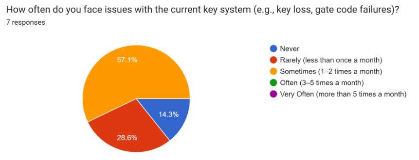
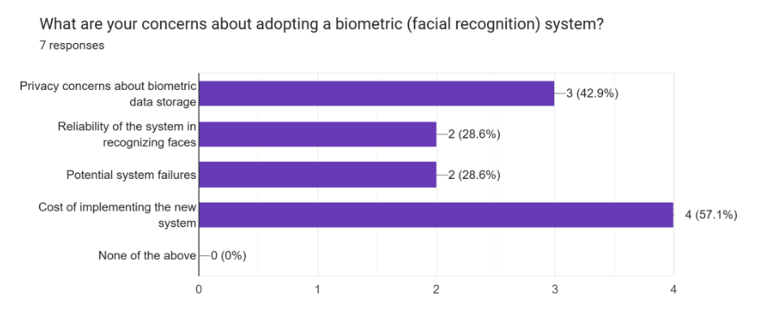
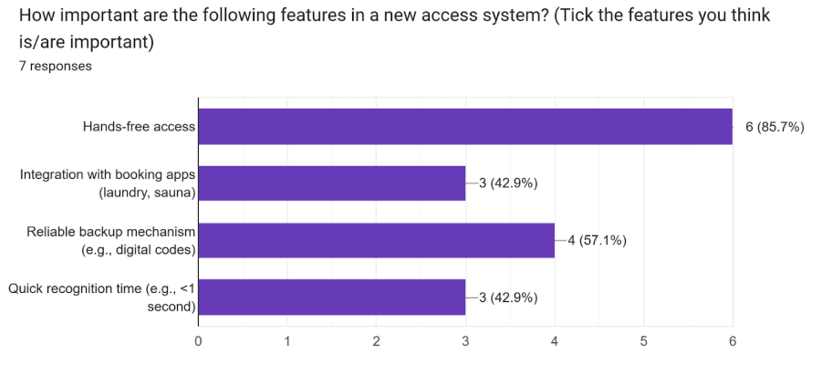
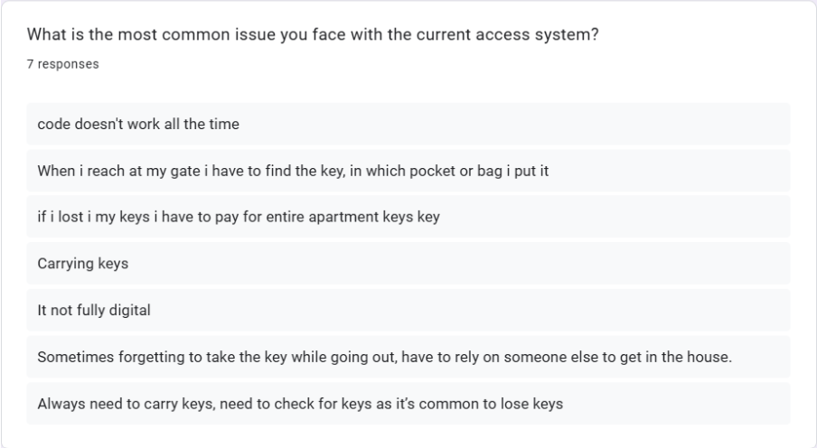
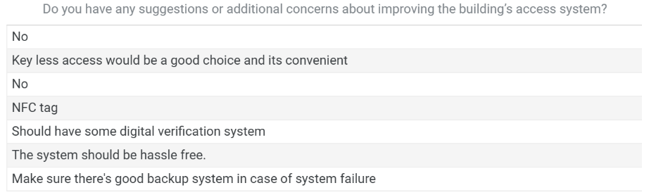

# Problem:

In most apartment buildings, it is common to see physical keys being used for
entry to apartments, main entrances, and shared facilities such as laundry and sauna rooms.
Most buildings have password-protected gates, which do not make either system very
friendly or secure. Tenants are often inconvenienced by having to carry keys everywhere,
they are afraid of losing them, and the penalties are huge-in the region of €300-if keys get
lost. Besides, gate codes tend to fail after hours or other situations not anticipated. The
various facility booking applications are helpful to date but still require keys physically to
enter, hence limiting their effectiveness.

Current solutions involve a self-powered key system without batteries, instead utilizing
unique digital IDs for secure access. It allows dynamic updates of access rights without
changing the hardware, can be programmed to open multiple locks, and is tamper-resistant
to prevent unauthorized duplication and tampering. Also, smart locks and IoT-based systems
enable remote access, which will improve convenience. However, system failures, privacy
concerns, and lack of integration with existing services, wear and tear due to heavy usage,
may be prone to adjustment in systems are some of the challenges facing their wide
adoption. What is really needed is a more robust solution with the user as the central focus
of such technology.

---

# Presenting my initial idea:

Face detection would be installed on a centralized application
for housing. Cameras would be installed at all major access points, including main gates,
apartment doors, and shared facilities, for hands-free entry. The tenants would register their
faces in the app, and a backup digital code would be provided in case the recognition fails.
The system will avoid the inconvenience of carrying keys and the risk of losing them, and it
will be incorporated into the facility booking application to ensure maximum usability and
security.

This idea solves existing problems by automating access, simplifying workflows, and aligning
with tenants' expectations about modern, convenient solutions. Furthermore, at each step,
privacy and reliability concerns will be taken care of through robust data encryption,
transparency, and failsafe mechanisms.

---

# Research question for gathering user requirements:

To narrow down the problem space and the user requirements of my project I prepare 4 research question-

**RQ1:** What are the main usability problems tenants face with the current
system?

**Reason for choosing the question:** This research question seeks to identify
and understand the primary usability issues that tenants have experienced
with their existing key systems. The aim is towards the discovery of specific
pain points.

**RQ2:** How do tenants consider the use of a biometric access system, such as
facial recognition?

**Reason for choosing the question:** This research question will look into
exploring the attitudes and perceptions that are held by tenants regarding the
implementation of a biometric access system, specifically about face
recognition technology or other accepted systems by tenants.

**RQ3:** What features or functionalities do tenants prioritize in a new access
system?

**Reason for choosing the question:** This question should identify high-level
design requirements, including ease of use, reliability, and integration with
existing apps.

---

# Methods:

I have used two method to find out the user requirements-

**Method 1:** I utilized the Focus group method, which contained three
participants who were two neighbors and one friend, for having an in-depth
discussion from which I came to know about their point of view. By sharing my
initial idea also to know the acceptance of my proposed solution. Also using
the methods, my research questions have responses as I discussed usability
issues, pain points, and brainstormed potential solutions with the participants.

**Method 2:** I created a Google survey with 10 questions to gather information
regarding the points I am trying to find for my research questions. I then
forward this survey among tenants, for example, friends of friends and known
people from my social circle. I received 7 responses from the survey. I used
both open-ended and closed-ended questions so that I can get assurance of
how the tenants are reacting to the idea which I proposed, and also getting
their ideas from which I can get to know what they want and what will be
convenient for them.

# Results:

---

**Results from method 1(Focus group):** The discussion from the focus group
was rich in the experiences and expectations of tenants. On issues of usability
challenges, **RQ1**, frequent failures of gate code make it difficult for
participants to access the building late at night, especially after 8 PM.
Similarly, it is very inconvenient to have to carry keys physically while handling
groceries or during emergency situations. The high penalties that could be
charged for lost keys were such that one felt a big financial and emotional
burden, and were always anxious not to misplace them.

Regarding **RQ2**, which concerns the perceptions of biometric access, the
interviewees found facial recognition highly convenient in contrast to a
physical key or gate code. In this respect, privacy emerged as an issue.
Participants were anxious about the management of their biometric
information, its eventual misuse, or the sale of information without their
permission. As optimistic as the participants were, the idea of biometric
access, transparency and building trust in regard to how data was treated
remained pivotal.

The main feature priorities (**RQ3**) identified by the tenants were hands-free
access and fast recognition times (less than 2 seconds). They also pointed
out that booking features for laundry and sauna rooms should be integrated
into the access system to make it easier to use. Real-time feedback, like
confirmation sounds or lights upon successful entry, was suggested to provide
clarity and confidence during use.

**Thematic analysis** was performed to identify major patterns and trends in data
from the focus group. Results were coded by key themes, including usability
challenges, privacy concerns, feature preferences, and fail-safe mechanisms.
Such a method allows for the orderly arrangement of the participants'
feedback, which was used to highlight the problems shared, such as
frustrations with the failure of the gate code and inconveniences involving
keys, coupled with desires for hands-free access and integrated booking
systems. Grouping of related ideas revealed the deeper-seated priorities,
such as reliability and transparency in the handling of data, right into the user
requirements.

---

**Result from method 2(Survey):** Regarding the research question RQ1 it has
been found that the present system is not convenient and is unreliable for
some, 57.1% of respondents reported problems with keys, such as loss,
forgetting, or inability to find them. The gate code frequently failed, especially
at night. The majority of users (42.9%) found carrying physical keys "very
inconvenient," further expressing dissatisfaction with the current access
method.

For the **RQ2** it is found that tenants are accepting of facial recognition, as 71.4% said
it would increase security and convenience. Still, they showed concern for the high
implementation cost (57.1%), privacy risks (42.9%), and reliability of the system
(28.6%). In addition, overcoming these concerns is key to tenants trusting and
accepting the system.

Lastly, findings for **RQ3**, tenants prioritized hands-free access at 85.7%, and reliable
backup mechanisms in the form of digital codes at 57.1%. Quick recognition time
and integration with booking apps for shared facilities were also important to them, at
42.9% each, reflecting a want for convenience and multifunctionality.

---

# Discussion:

I think I found quite impressive responses from the methods to find out more
about user requirements to respond to my research questions. From the open-ended
questions of the survey I got some interesting answers, where my users shared their issues
regarding current system, for example -

The most valuable findings I got from the response -

I can work on these suggestions to decide the features of my proposed system. I learned
from this that there might be a solution of NFC tags in mobile apps like we use mobile pay to
my proposed system, if facial recognition does not work. From the results it is clear that
users are interested in facial recognition in the lock system but there might be issues
regarding cost and privacy which need to be addressed.
